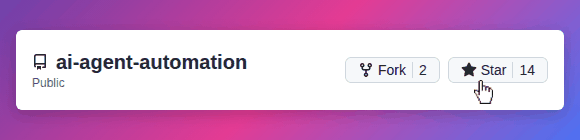

# ⚡ AI Agent Automation

**Developer-first, local-first workflow engine for AI agents**

Build, run, schedule, and debug **multi-step AI agent workflows** with **full observability**, **deterministic execution**, and **zero vendor lock-in**.

---

> [!TIP]
> ⭐ Starring this repo helps more developers discover **AI Agent Automation**
>
> 

---

## ⚙️ How It Works

1. You create a **Workflow** made of ordered steps (**LLM**, **HTTP**, **Tool**, **Delay**)
2. Running a workflow creates a **Task** (manual or scheduled)
3. An **Agent** executes each step **deterministically**
4. Every step produces:

   * input
   * output
   * success / failure
5. You inspect, debug, re-run, and automate with **full visibility**

---

## 🧠 What This Project Is

**AI Agent Automation Platform** is a **developer-first execution engine** for AI-driven workflows.

This is **not**:

* A prompt playground
* A chatbot UI demo
* A SaaS-locked automation tool

This **is**:

* A real workflow engine
* Deterministic, step-by-step execution
* Agent-driven automation
* Fully local & self-hosted

If you like tools such as **n8n**, **Zapier**, or **Temporal** — but want something **AI-native**, **local**, and **inspectable**, this project is for you.

---

## 👤 Who This Is For

✔ Developers building AI-driven automation
✔ Teams needing inspectable, debuggable execution
✔ Privacy-conscious & self-hosted setups

❌ Chatbot-only demos
❌ Prompt-only experiments
❌ No-code SaaS users

---

## ✨ Core Capabilities

### 🤖 Agent-Driven Execution

* Autonomous AI agents execute workflows
* Pluggable LLM support (OpenAI, Gemini, Groq, local models)
* Deterministic execution model
* Explicit inputs & outputs per step
* Step-level success / failure tracking

---

### 🔗 Workflow Automation

* Visual workflow builder
* Ordered, sequential steps
* Supported step types:

  * **LLM** — reasoning & generation
  * **HTTP** — API calls
  * **Tool** — internal actions
  * **Delay** — time-based control

Each workflow run becomes a **Task** with full traceability.

---

### ⏱ Scheduling (Cron Automation)

* Cron-based schedules
* Automatic task creation
* Ideal for:

  * Monitoring
  * Reports
  * Background automation
  * Periodic data sync

---

### 📊 Observability & Debugging

* Task execution timeline
* Step-level outputs & errors
* Real-time system logs
* Clear failure attribution
* Built for **root-cause analysis**, not guesswork

---

### 🧠 Agent Memory *(In Progress)*

* Persistent memory per agent
* Store learned facts & system knowledge
* Enables adaptive workflows over time

---

## 🏗 High-Level Architecture (Simplified)

```
Frontend (Next.js)
      ↓
REST API (Express)
      ↓
Workflow Engine
  ├─ Agent Runner
  ├─ Step Executor
  ├─ Tool Registry
  ├─ Scheduler
  └─ Logger
      ↓
MongoDB (Workflows, Tasks, Agents, Logs)
```

> 📘 Detailed architecture, execution model, and internals:
> [https://vmdeshpande.github.io/ai-automation-platform-website/](https://vmdeshpande.github.io/ai-automation-platform-website/)

---

## 🛠 Tech Stack

**Backend**

* Node.js + Express
* MongoDB
* Cron Scheduler
* Custom Agent Runtime

**Frontend**

* Next.js
* React
* Tailwind CSS

**AI & Automation**

* Pluggable LLM adapters
* Tool sandboxing
* Local-first execution

---

## 🧪 Common Use Cases

* AI workflow automation
* Scheduled backend jobs
* Monitoring & alerting agents
* Document processing pipelines
* Internal developer tools
* Secure AI experimentation

---

## 🔐 Security & Privacy

* Fully self-hosted
* No data leaves your system by default
* Secrets via environment variables only
* No vendor lock-in
* No hidden SaaS dependencies

---

## 🚀 Local Development

### 1️⃣ Clone

```bash
git clone https://github.com/vmDeshpande/ai-agent-automation.git
cd ai-agent-automation
```

### 2️⃣ Backend

```bash
cd backend
npm install
cp .env.example .env
npm run dev
npm run worker
```

Backend → `http://localhost:5000`

### 3️⃣ Frontend

```bash
cd frontend
npm install
npm run dev
```

Frontend → `http://localhost:3000`

---

## 📂 Repository Structure

```
backend/
  ├─ agents/
  ├─ models/
  ├─ routes/
  ├─ services/
  ├─ tools/
  └─ workers/

frontend/
  ├─ app/
  ├─ components/
  ├─ context/
  └─ styles/
```

---

## 🛣 Roadmap

Planned features and long-term vision live on the project website:

👉 [https://vmdeshpande.github.io/ai-automation-platform-website/](https://vmdeshpande.github.io/ai-automation-platform-website/)

---

## 🤝 Contributing

Contributions are welcome.

If you enjoy:

* AI agents
* Backend systems
* Automation engines
* Developer tooling

You’ll feel at home here.

See [CONTRIBUTING.md](CONTRIBUTING.md) for details.

---

## 📄 License

Apache License 2.0

---

> **Not a prompt playground.**
> **A real AI execution engine.**
