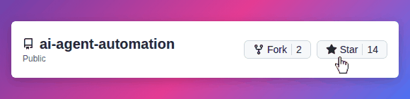
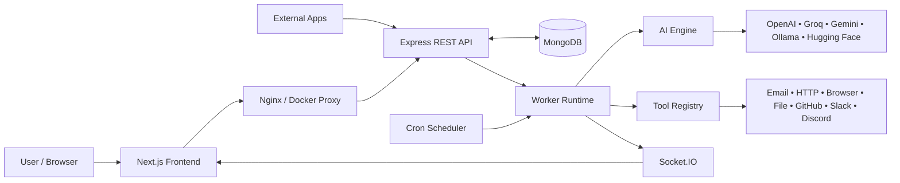

<div align="center">

# AI Agent Automation

### Local-first workflow automation for AI agents

Build, run, inspect, replay, and expose AI-powered workflows from your own infrastructure.

<p>
  <a href="LICENSE"></a>
  
  
  
  
  
</p>

<p>
  <a href="https://vmdeshpande.github.io/ai-automation-platform-website/docs"><strong>Documentation</strong></a>
  &middot;
  <a href="docs/docker-deployment.md"><strong>Docker Guide</strong></a>
  &middot;
  <a href="docs/workflow-engine.md"><strong>Workflow Engine</strong></a>
  &middot;
  <a href="docs/privacy.md"><strong>Privacy</strong></a>
  &middot;
  <a href="https://github.com/vmDeshpande/ai-agent-automation/issues"><strong>Issues</strong></a>
</p>

<p>
  <a href="#getting-started">Quick Start</a>
  &middot;
  <a href="#first-workflow">First Workflow</a>
  &middot;
  <a href="#configuration">Configuration</a>
  &middot;
  <a href="#troubleshooting">Troubleshooting</a>
  &middot;
  <a href="#contributing">Contributing</a>
</p>



</div>

---

## Overview

AI Agent Automation is a self-hosted workflow engine for building and operating AI-driven automations. It combines a visual workflow builder, agent configuration, deterministic task execution, document RAG, semantic memory, tool integrations, workflow APIs, and execution observability.

It is built for developers who want inspectable automation instead of a black-box chatbot or hosted SaaS dependency.

<table>
  <tr>
    <td width="33%">
      <strong>Local-first</strong><br>
      Run the platform with your own MongoDB, provider keys, workers, and infrastructure.
    </td>
    <td width="33%">
      <strong>Inspectable</strong><br>
      Every workflow run becomes a task with step inputs, outputs, logs, status, and replay controls.
    </td>
    <td width="33%">
      <strong>AI-native</strong><br>
      Agents can use provider-specific models, memory, document retrieval, and automation tools.
    </td>
  </tr>
</table>

## What You Can Build

<table>
  <tr>
    <td width="50%">
      <strong>Workflow Automation</strong><br>
      Create visual workflows with LLM, HTTP, delay, file, email, browser, document, condition, switch, parallel, join, approval, and agent call nodes.
    </td>
    <td width="50%">
      <strong>Agent Workspaces</strong><br>
      Configure agents with provider, model, role, instructions, semantic memory, and tool capabilities.
    </td>
  </tr>
  <tr>
    <td width="50%">
      <strong>Document Intelligence</strong><br>
      Upload documents, chunk and embed them, then chat with source attribution and retrieval controls.
    </td>
    <td width="50%">
      <strong>Agent Teams</strong><br>
      Build multi-agent teams with a visual team builder, war room chat, session logs, and A2A webhook support.
    </td>
  </tr>
  <tr>
    <td width="50%">
      <strong>Workflow APIs</strong><br>
      Expose workflows through public endpoints with custom slugs and optional API-key authentication.
    </td>
    <td width="50%">
      <strong>Operations Dashboard</strong><br>
      Track live workflow status, execution trends, task timelines, logs, metrics, and workflow insights.
    </td>
  </tr>
</table>

## Architecture At A Glance


```mermaid
flowchart LR

    User["User / Browser"] --> Frontend["Next.js Frontend"]
    External["External Apps"] --> API

    Frontend --> Proxy["Nginx / Docker Proxy"]
    Proxy --> API["Express REST API"]

    API <--> DB[("MongoDB")]

    API --> Worker["Worker Runtime"]
    Worker --> AI["AI Engine"]
    Worker --> Tools["Tool Registry"]

    Worker --> Socket["Socket.IO"]
    Socket --> Frontend

    AI --> Providers["OpenAI • Groq • Gemini • Ollama • Hugging Face"]

    Tools --> Integrations["Email • HTTP • Browser • File • GitHub • Slack • Discord"]

    Scheduler["Cron Scheduler"] --> Worker
```

| Module | Responsibility |
| ------- | -------------- |
| **Frontend** | Workflow builder, dashboard, agents, documents, memory, teams, settings, logs, and insights. |
| **API** | Authentication, REST APIs, workflow management, webhooks, scheduling, templates, and business logic. |
| **MongoDB** | Stores users, workflows, tasks, agents, documents, semantic memory, schedules, logs, telemetry, and settings. |
| **Worker Runtime** | Polls pending tasks, executes workflow graphs, handles branching, retries, approvals, and records execution results. |
| **AI Engine** | Semantic memory, document retrieval (RAG), MCP, provider adapters, and agent collaboration. |
| **Tool Registry** | Executes integrations such as HTTP, Email, Browser, File, GitHub, Slack, and Discord tools. |
| **Scheduler** | Creates workflow tasks from cron schedules. |
| **Realtime** | Streams workflow progress and task updates through Socket.IO. |

# Getting Started

Choose the setup that best fits your needs.

| Setup | Recommended For |
| ------ | --------------- |
| 🐳 **Docker Quick Start** | New users, self-hosting, demos, and running the complete platform with minimal setup. |
| 🛠️ **Local Development** | Contributors and developers who want faster backend/frontend iteration. |

---

## Quick Start with Docker (Recommended)

Docker Compose starts the complete platform, including:

- MongoDB Replica Set
- Backend API
- Worker Runtime
- Frontend
- Nginx Reverse Proxy

<table>
  <tr>
    <td><strong>Best for</strong></td>
    <td>New users, demos, integrated testing, and self-hosted deployments.</td>
  </tr>
  <tr>
    <td><strong>Requires</strong></td>
    <td>Git, Docker Compose, and at least one LLM provider API key or a local Ollama instance.</td>
  </tr>
  <tr>
    <td><strong>Frontend</strong></td>
    <td><code>http://localhost:3000</code></td>
  </tr>
</table>

### 1. Clone the Repository

```bash
git clone https://github.com/vmDeshpande/ai-agent-automation.git
cd ai-agent-automation/infra
cp .env.example .env
```

### 2. Configure Environment

Edit `infra/.env`:

```env
JWT_SECRET=change-this-to-a-long-random-string

# Configure one or more providers
OPENAI_API_KEY=
GROQ_API_KEY=
GEMINI_API_KEY=
HF_API_KEY=

# Local Ollama (optional)
OLLAMA_HOST=http://host.docker.internal:11434
```

### 3. Start the Platform

```bash
docker compose up --build
```

Open:

```text
http://localhost:3000
```

### Useful Commands

```bash
docker compose ps
docker compose logs -f backend worker frontend
docker compose down
```

Remove all containers **and MongoDB data**:

```bash
docker compose down -v
```

---

# Local Development

Run the services directly on your machine for faster development.

> **Note**
>
> MongoDB must be available with **Replica Set** support enabled.
> You can run MongoDB locally or start only MongoDB using Docker while running the backend, worker, and frontend natively.

<table>
  <tr>
    <th>Terminal</th>
    <th>Service</th>
    <th>Default URL</th>
  </tr>
  <tr>
    <td>1️⃣</td>
    <td>Backend API</td>
    <td><code>http://localhost:5000</code></td>
  </tr>
  <tr>
    <td>2️⃣</td>
    <td>Worker Runtime</td>
    <td>Background Service</td>
  </tr>
  <tr>
    <td>3️⃣</td>
    <td>Frontend</td>
    <td><code>http://localhost:3000</code></td>
  </tr>
</table>

### 1. Clone the Repository

```bash
git clone https://github.com/vmDeshpande/ai-agent-automation.git
cd ai-agent-automation
```

### 2. Start the Backend

```bash
cd backend

npm install

cp .env.example .env

npm run dev
```

Backend API:

```text
http://localhost:5000
```

---

### 3. Start the Worker

Open a **new terminal**:

```bash
cd backend

npm run worker
```

> The worker executes workflow tasks. Workflow execution will not function unless the worker is running.

---

### 4. Start the Frontend

Open another **new terminal**:

```bash
cd frontend

npm install

npm run dev
```

Frontend:

```text
http://localhost:3000
```

---

## Project Structure During Local Development

```text
Terminal 1 → Backend API
Terminal 2 → Worker Runtime
Terminal 3 → Frontend
MongoDB   → Replica Set
```

## First Workflow

After the app is running:

| Step | Action |
| --- | --- |
| 1 | Register a user account. |
| 2 | Open Settings and confirm at least one LLM provider is configured. |
| 3 | Create an Agent and choose its provider and model. |
| 4 | Create a Workflow from scratch or from a template. |
| 5 | Add an LLM node and assign the workflow to your agent. |
| 6 | Run the workflow. |
| 7 | Open the generated Task and inspect step inputs, outputs, logs, and status. |

If a workflow stays pending, the worker is probably not running.

## Configuration

Common backend variables live in [backend/.env.example](backend/.env.example). Docker variables live in [infra/.env.example](infra/.env.example).

| Variable | Required | Purpose |
| --- | --- | --- |
| `JWT_SECRET` | Yes | Signs user authentication tokens. Use a long random value. |
| `MONGO_URI` | Yes | MongoDB connection string. Docker sets this for the internal Mongo service. |
| `MONGO_ROOT_USER` | Yes (Docker) | MongoDB root username for Docker initialization. |
| `MONGO_ROOT_PASSWORD` | Yes (Docker) | MongoDB root password for Docker initialization. |
| `MONGO_APP_USER` | Yes (Docker) | MongoDB application username with least-privilege access to `ai-agent` database. |
| `MONGO_APP_PASSWORD` | Yes (Docker) | MongoDB application password for `MONGO_APP_USER`. |
| `OPENAI_API_KEY` | Optional | OpenAI models and embeddings. |
| `GROQ_API_KEY` | Optional | Groq-hosted models. |
| `GEMINI_API_KEY` | Optional | Google Gemini models and embeddings. |
| `HF_API_KEY` | Optional | Hugging Face models and embeddings. |
| `OLLAMA_HOST` | Optional | Local Ollama endpoint, such as `http://localhost:11434` locally or `http://host.docker.internal:11434` in Docker. |
| `EMAIL_HOST`, `EMAIL_PORT`, `EMAIL_USER`, `EMAIL_PASS`, `EMAIL_FROM` | Optional | Email tool configuration. |
| `MCP_ENABLED`, `MCP_CONFIG_PATH`, `MCP_CONFIG_JSON`, `MCP_SERVER_URL` | Optional | MCP integration configuration. |
| `GITHUB_TOKEN`, `SLACK_WEBHOOK_URL`, `DISCORD_WEBHOOK_URL` | Optional | Integration tool credentials. |
| `TELEMETRY_ENABLED`, `DISABLE_ALL_ANALYTICS` | Optional | Controls optional telemetry. |

Do not commit `.env` files or secrets.

## Project Structure

```text
backend/
  server.js
  src/
    agents/       workflow runner, executor, handlers, event broker
    controllers/  API controllers
    models/       Mongoose models
    routes/       Express routes
    services/     domain services
    tools/        tool registry and tool implementations
    workflow/     node catalog and workflow helpers

frontend/
  src/app/        Next.js App Router pages
  src/components/ shared UI and workflow components
  src/context/    client state providers
  src/lib/        API client and helpers
  src/types/      TypeScript types

infra/
  docker-compose.yml
  nginx/
```

## Development Commands

| Command | Where | Purpose |
| --- | --- | --- |
| `npm run lint` | repo root | Lint frontend and backend source. |
| `npm run format` | repo root | Format frontend and backend source. |
| `npm test` | `backend/` | Run Jest handler tests. |
| `npm run build` | `frontend/` | Build the Next.js frontend. |

## Documentation Map

<table>
  <tr>
    <td><a href="docs/architecture.md">Architecture</a></td>
    <td>System overview and major components.</td>
  </tr>
  <tr>
    <td><a href="docs/workflow-engine.md">Workflow Engine</a></td>
    <td>Runner, executor, task lifecycle, and step flow.</td>
  </tr>
  <tr>
    <td><a href="docs/workflow-builder.md">Workflow Builder</a></td>
    <td>Graph builder conventions.</td>
  </tr>
  <tr>
    <td><a href="docs/workflow-variables.md">Workflow Variables</a></td>
    <td>Interpolation and step output references.</td>
  </tr>
  <tr>
    <td><a href="docs/agent-system.md">Agent System</a></td>
    <td>Agents, roles, execution, and memory.</td>
  </tr>
  <tr>
    <td><a href="docs/document-intelligence-rag.md">Document RAG</a></td>
    <td>Document upload, chunking, embeddings, and chat.</td>
  </tr>
  <tr>
    <td><a href="docs/how-to-add-custom-tool.md">Custom Tools</a></td>
    <td>Add a new automation tool.</td>
  </tr>
  <tr>
    <td><a href="docs/mcp-integration.md">MCP Integration</a></td>
    <td>MCP setup and usage.</td>
  </tr>
  <tr>
    <td><a href="docs/agent-to-agent.md">A2A</a></td>
    <td>Agent-to-agent protocol and webhook flow.</td>
  </tr>
  <tr>
    <td><a href="docs/docker-deployment.md">Docker Deployment</a></td>
    <td>Production-style Docker setup.</td>
  </tr>
  <tr>
    <td><a href="docs/privacy.md">Privacy</a></td>
    <td>Data handling and deployment responsibilities.</td>
  </tr>
  <tr>
    <td><a href="docs/telemetry.md">Telemetry</a></td>
    <td>Optional telemetry behavior and controls.</td>
  </tr>
</table>

## Troubleshooting

<details>
<summary><strong>Workflows stay pending</strong></summary>

Start the worker:

```bash
cd backend
npm run worker
```

</details>

<details>
<summary><strong>MongoDB transaction or replica-set errors</strong></summary>

Use Docker Compose, or make sure your local MongoDB is running as a replica set.

```bash
cd infra
docker compose down -v
docker compose up --build
```

</details>

<details>
<summary><strong>Port already in use</strong></summary>

Change these values in `infra/.env`:

```bash
MONGO_PORT=27018
BACKEND_PORT=5001
FRONTEND_PORT=3001
```

The Docker frontend derives its backend URL from `BACKEND_PORT`; do not set `NEXT_PUBLIC_API_URL` manually for Docker deployments.

</details>

<details>
<summary><strong>LLM calls fail</strong></summary>

Confirm that the agent has a provider and model selected, and that the matching environment variable is set. For Ollama, confirm the host is reachable from the process making the call.

</details>

<details>
<summary><strong>Email, Slack, Discord, or GitHub tools fail</strong></summary>

Check the corresponding environment variables and inspect backend and worker logs:

```bash
cd infra
docker compose logs -f backend worker
```

</details>

## Security And Privacy

<table>
  <tr>
    <td><strong>Self-hosted</strong></td>
    <td>Workflow data, documents, logs, and memory are stored in your MongoDB deployment.</td>
  </tr>
  <tr>
    <td><strong>Secrets</strong></td>
    <td>Provider keys and integration credentials are read from environment variables.</td>
  </tr>
  <tr>
    <td><strong>Telemetry</strong></td>
    <td>Optional telemetry is designed not to collect prompts, workflow definitions, memories, uploaded documents, API keys, execution logs, or user identities.</td>
  </tr>
</table>

Review [docs/privacy.md](docs/privacy.md) before exposing a deployment to other users.

## Contributing

Contributions are welcome. Good first areas include docs, workflow templates, UI polish, tests, and new tool integrations.

Read [CONTRIBUTING.md](CONTRIBUTING.md) before opening a pull request.

Helpful references:

- [Custom tool guide](docs/how-to-add-custom-tool.md)
- [Workflow engine docs](docs/workflow-engine.md)
- [Docker deployment guide](docs/docker-deployment.md)

## License

Apache License 2.0. See [LICENSE](LICENSE).
